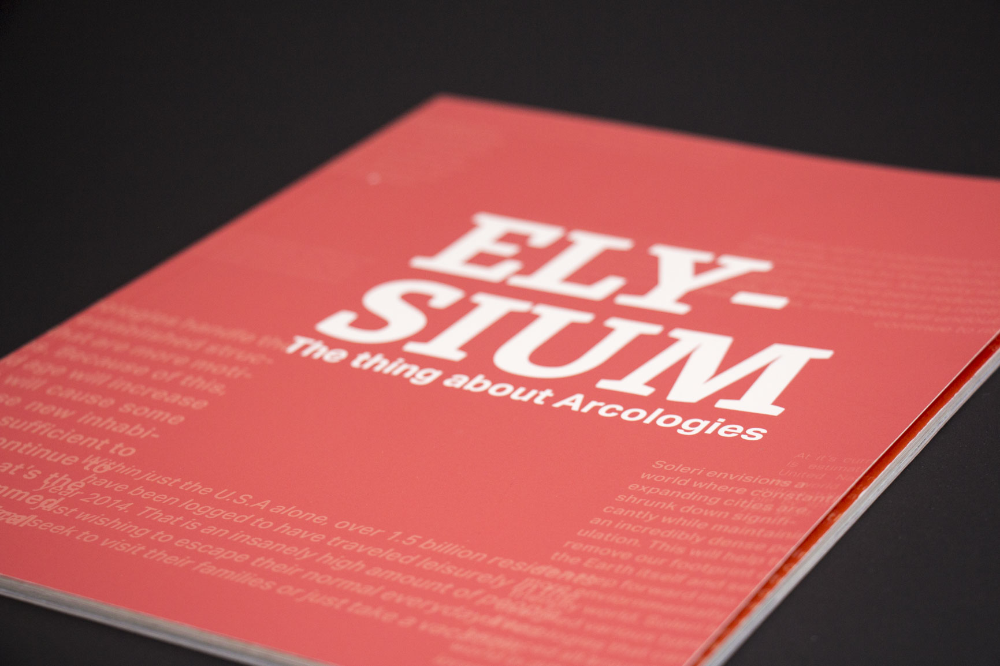
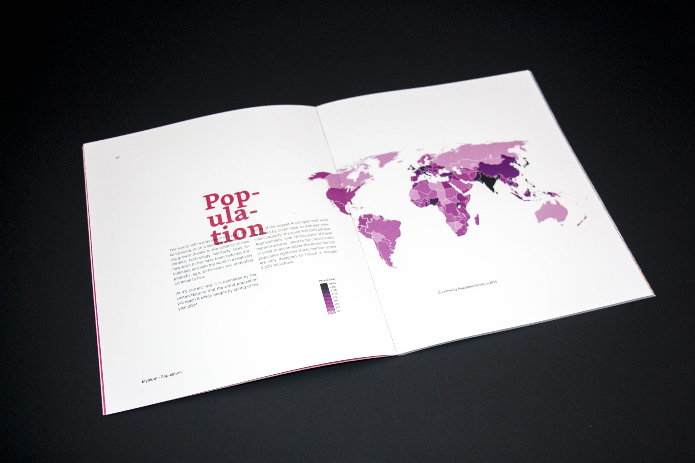
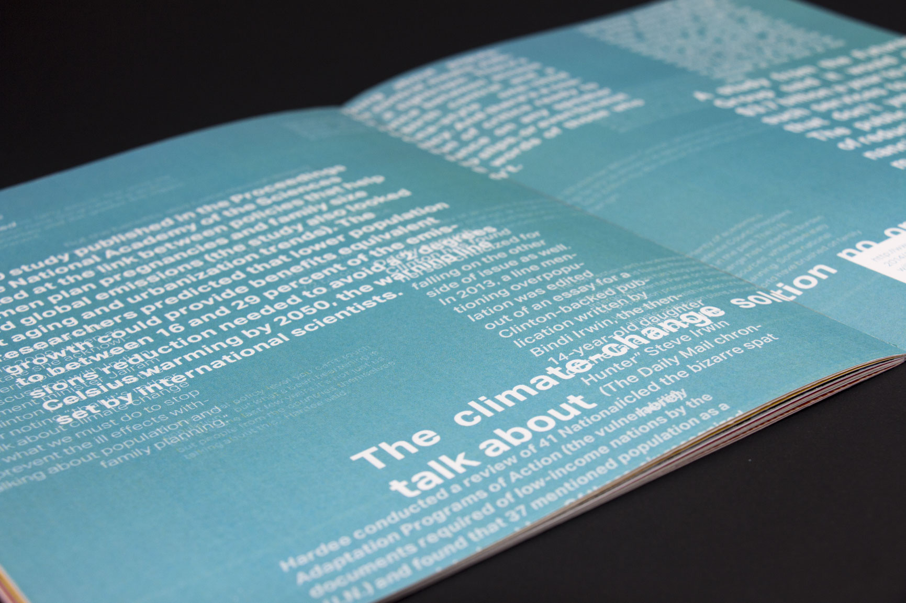
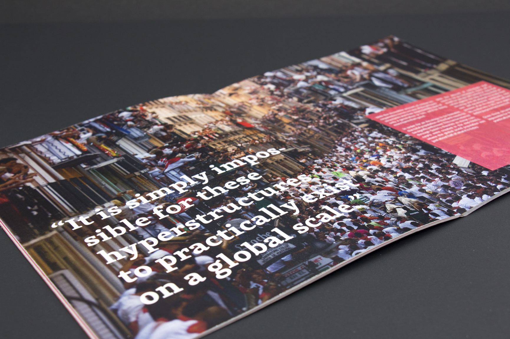

Elysium is a book responding to Paolo Soleri's concept of Arcologies. Hyper dense cities that allow people to go about their day without ever needing to drive at all.

This book is a reflection of my own perspective, being a devil's advocate, that this kind of concept is impossible to realize. All content is written by myself, backed by research supporting my arguments.

Typography, composition and image layout were a focus on this project. The fading text in the background is a representation of the human nature's desire to expand and diversify itself. All the text within the book is hidden on the cover itself, alluding to it's contents.

##Division Pages
Division pages between chapters served as an introduction to a new topic, as well as presenting a scramble to research data and quotes, a website with related information is included on the bottom right of the page.

