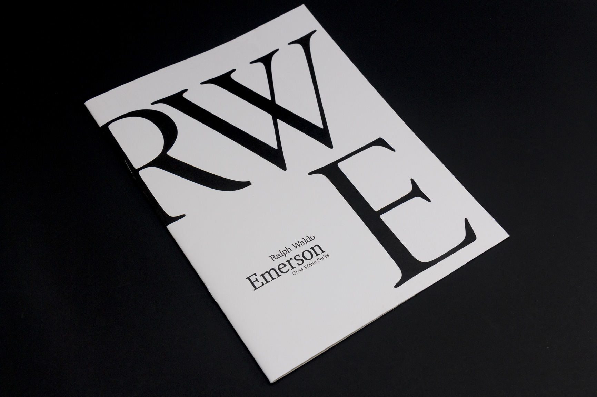
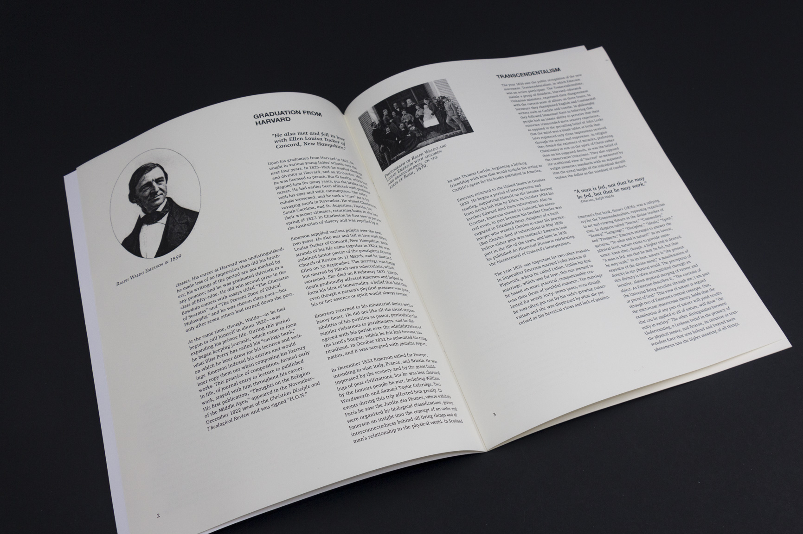
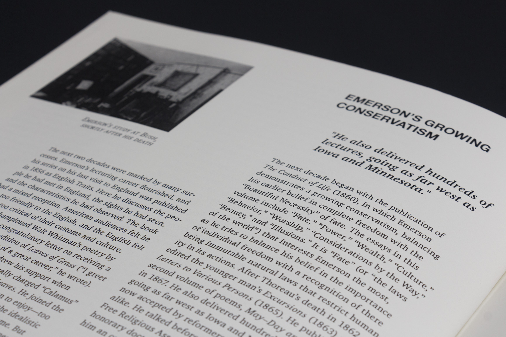
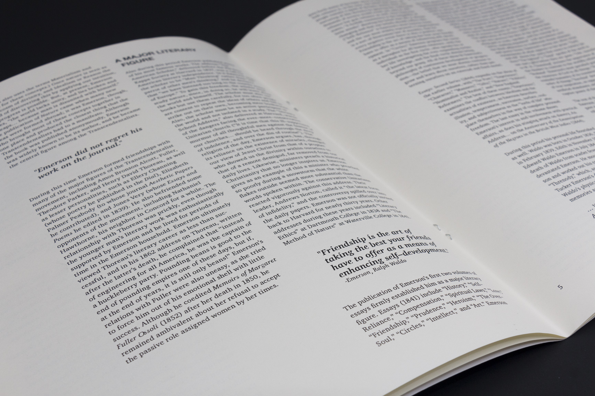

Focusing on the life and legacy of writer Ralph Waldo Emerson, this booklet was created to document his life using various typographic and image layouts.

A particular challenge to this project was, Emerson lived in an age where photography was barely available, and thus, imagery of him is extremely scarce. Because of this, emphasis on typographic details were placed, and images were used to help break spreads of text.

