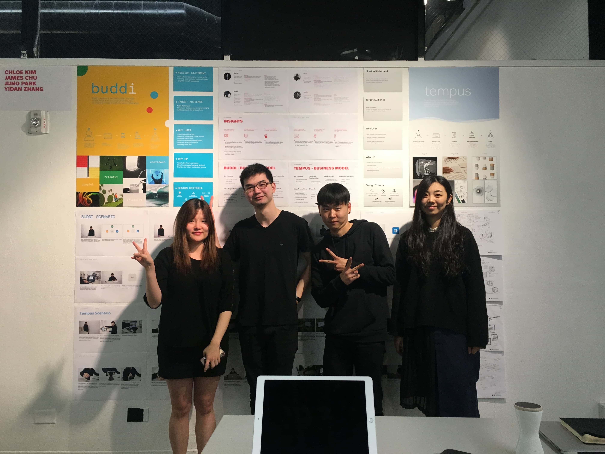
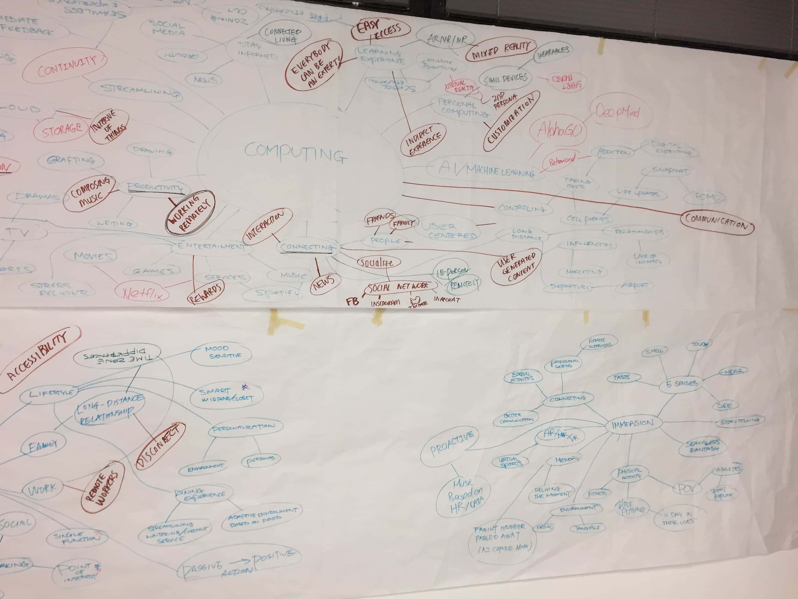
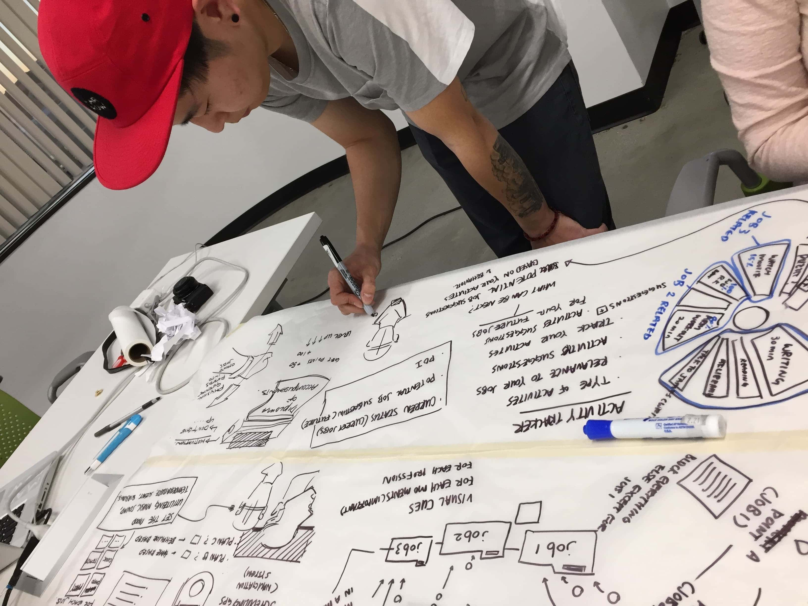
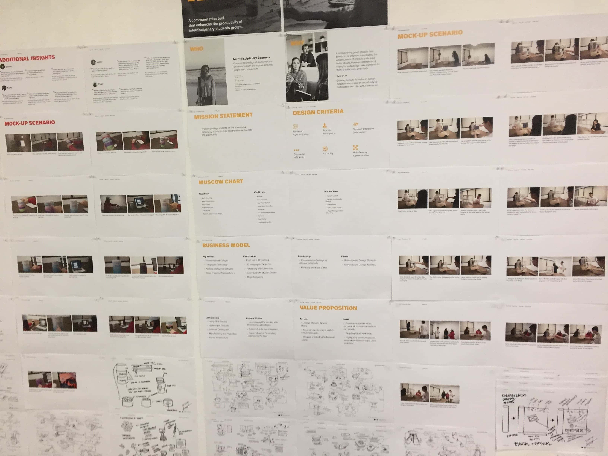
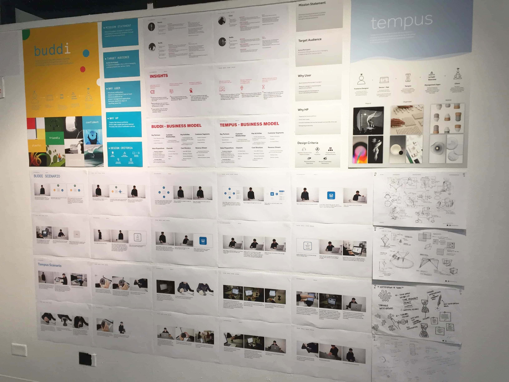
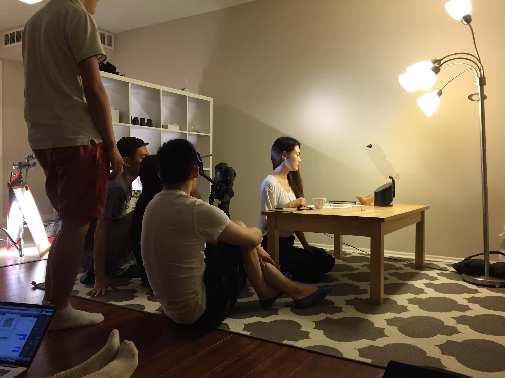
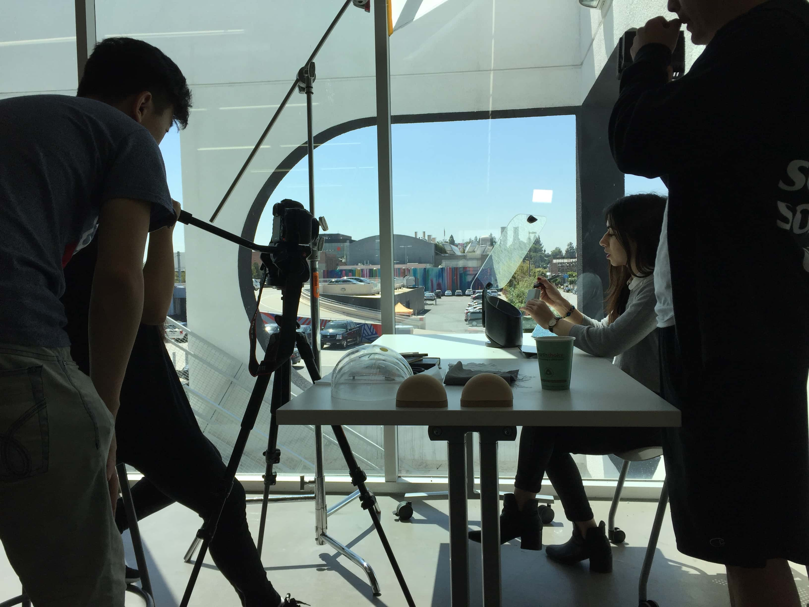

##Overview 
A course sponsored by HP exploring the future of computing technology. The project was done in teams consisting of individuals from various diciplines. Over the course of 14 weeks, we were to conceptualize, pitch, design and produce an ecosystem of both the physical product and accompanying digital interfaces/interactions. This course was done with the guidance of multiple professors from ArtCenter College of Design, as well as representatives and experts from HP.

Knoq is a product that allows people to communicate by utilizing advance cameras and holographic technology, eliminating the need for users to mail or physically posess an item to examine.

###Confidentiality
Due to the nature of this project, release of materials is still restricted and thus this study will only cover the process at a higher level and images recorded throughout.

##Brief 
- Redefine the future of computing.
- Create an ecosystem of products integrating both industrial and interaction design.

##Goal 
- Enhance the way we communicate with others when surrounding physical objects.

###Deliverables
With only 14 weeks, we had a tall order to deliver, however this is a general breakdown:
- Conceptualize what the future of computing will become.
- Pitch concepts based on research and field study.
- Design both the physical product and accompanying interface.
- Showcase how this will integrate in everyday life.

<!-- ###Scenario Video
To showcase how our product would be used in a day-to-day setting, we produced this short video. 
<iframe src="https://player.vimeo.com/video/227992076" width="640" height="370" frameborder="0" webkitallowfullscreen mozallowfullscreen allowfullscreen></iframe> -->

##Team
We were assigned teams of 4 at the professor's discresion, and I would end up working with [Chloe Kim](http://chloekim.info/), Juno Park, Yidan Zhang. Based on our disciplines, we were split 2 Graphic Design Majors, and 2 Product Design Majors.

_Left to Right: Chloe, James, Juno, Yidan_

###Roles
Being some of the first group project experiences, we would have the traditional "do everything together" mindset until around 7 weeks in. We, as a team, would individually carry out multiple different roles in order to help one another, so there is no clear cut line on who did what, but as an overview:

- I will ultimately be elected to step up as Project Manager for the team as we encountered extremely inefficient meetings and conflicting decisions for the first 7 weeks. 
- Chloe Kim, with the most experience in the team, would help lead key decisions and creating graphics and UI/UX alongside myself.
- Juno Park and Yidan Zhang, our two Industrial Product Designers, would design, model and produce the physical product for our concept.

<!-- ###Managing the Team 
This will be my first time leading a team for such a complex project. I consulted multiple people in the field and due diligence on my research of the role before starting. My strategy would be creating to-do lists in Google Sheets and following along an Agile flow on a weekly basis.

`INSERT SCREENSHOT OF GOOGLE SHEET`

**Learnings**  
- While we saw improvements to our team dynamics and flow, I would end up being fairly inconsistent in enforcing team decisions. I realized that being too close to the team can sometimes sway and differ objective judgement. Thankfully, Juno Park would later assist me in that aspect.
-  -->

##Ideation and Research
We will ultimately be revising and researching 2 primary ideas to pitch HP for 8 weeks. In this time, we conducted vast amounts of research including but not limited to, research papers, interviewing experts, interviewing target users, observing existing use cases, defining new use cases, business models, value propositions, and more.

_Mindmap Ideations of Various Ideas_

_Juno Ideating on Potential Use Cases_

###Presentation Desks
Every week, we would present our findings and research on the wall for feedback and comments. Below are a few of these at different times.

_Early Presentation of 2 Ideas_

_Mid-term Presentation of Evolved Ideas_

##Disaster
As a team, we hit a major roadblock when pitching our desired concept towards the 9th week. Due to the constant iteration and refinement of our concepts, we ended up slightly off-target from redefining "the future of computing". At this stage, we were unable to start final production until we had cleared the issue.

###Resolution
To hopefully resolve our situation, we backtracked our thinking, and revisited all the research we had previously conducted in the past and constrasting it with our proposal at the end of it. By taking a step back, we were able to reorient ourselves with our primary goals and presented a stronger idea that met all the goals of the project.

We would ultimately lose approximately a week of progress to resolve this issue. However, we were able to bounce back quickly and despite losing days of sleep leading up to the final, it was not a noticable deficit.

##Scenario
To help us showcase a scenario in which our product can be utilized, we had to create a short film in order to communicate that. We distilled our goals and ideas down, alongside references from various inspirations to help us narrow down our scenario. The script would be written by me, and Chloe art directed the sequence.

`INSERT STORYBOARD`

###Filming
We hired a fellow ArtCenter Film Major student to help us direct and film our scenario video. Nick Wang would be our director for the sequence, along with 3 other students who assisted in camerawork and lighting. With the physical product finished just hours before the shoot, we would film 2 sessions over the course of 2 days.

_Filming Session of the Indoor Scene_

_Filming Session of the Office Scene_

###Editing
With the finals drawing near, the availability of editors and motion graphic designers were scarce. We ended up hiring [Kevin Jan](http://kevinjan.com/) an ArtCenter alum who is now working professionally.

For the remainder of the term, I would work alongside Kevin in editing and animating sequences of the video. I was also responsible for deciding the soundtrack to be used, which was found after listening to hundreds of different samples.

My primary contribution in this stage were providing the final cut, animating the sequences of the screens, and color correction.

##Outcome
After an excrutiating 14 weeks of stumbling and getting things done, I am frankly quite proud of our result. There is no doubt areas that can be improved, but I feel as if the final result is notable.

Our final presentation was met with great response from both the audience and representatives from HP themselves.
