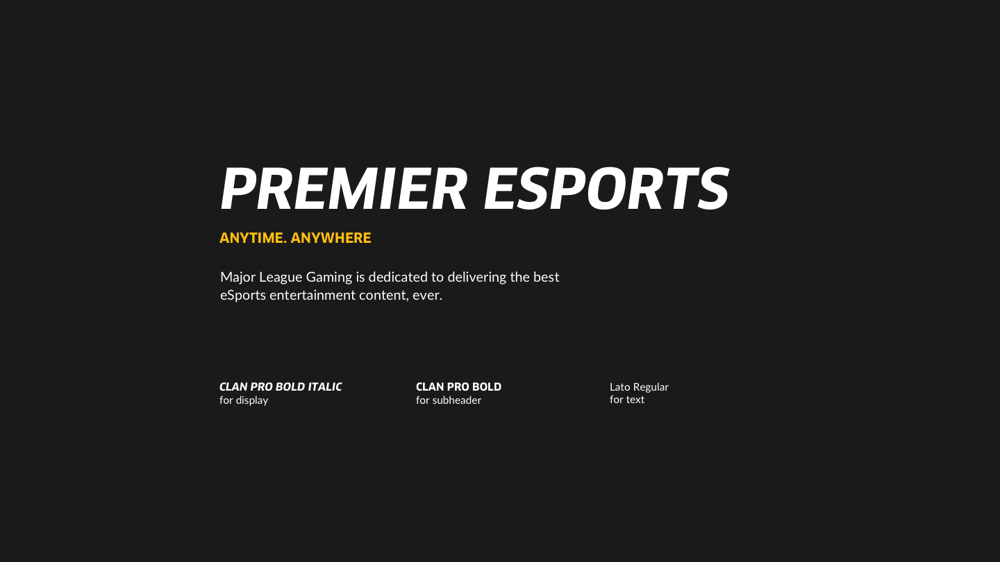
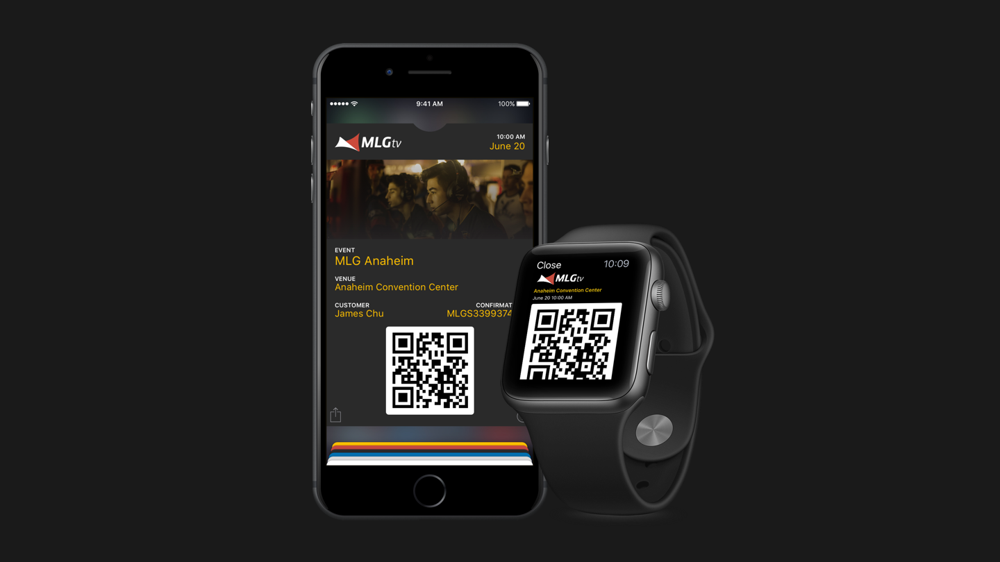

##Overview
Major League Gaming (MLG) was founded in 2002 as an eSports entertainment organization. MLG operates MLG.tv, the #1 online broadcast network for professional level competitive gaming; the MLG Pro Circuit, the longest-running eSports league in North America; and GameBattles, the largest cross platform online gaming tournament system with 9 million registered users across the globe.

##Challenge
As Major League Gaming strives to become a household name around the world, it begins to fall short against it’s competitors. A new and more robust foundation must be built to reach for even greater heights.

##Goals
- Refocus the direction of the brand.
- Redesign the brand to fit our new strategy

##Research
In order to create a new brand that is unique to MLG, I conducted a complete audit of the brand as it currently stands today.

Firstly, it is paramount that MLG’s mission statement is preserved in order to guide this rebrand. Thus it is extracted as-is from their existing website.

>MLG’s mission is to promote eSports globally through premier competition and to deliver premium gaming content to viewers anytime, anywhere through our global streaming platform - MLG.tv

_Detailed audit of company information._

###Assessment
From the information gathered, it was determined that there was a lack of consistency in the overall brand and design, in addition to that, color fragmentation on the web is especially severe.

##Competitior Landscape
Since it seems that Major League Gaming needs to hold up on two different fronts, I needed to analyze the competitor landscape separately.

##Event Attendence
To further my research, I attended a competition being held at the Anaheim Convention Center, MLG Anaheim, a Call of Duty tournament series.

###Assessment
I gained great insights at how MLG promoted and produced it's events, and especially the attitude of the audience. It was because of this visit that I was able to really know who I was targeting. Young teens male/female alike that have explosive passion and energy for gaming and eSports.

##Strategy
The current brand started to feel a bit dated, and did not reflect well on how far the company has grown in the years.

By using a brand driver, I was able to pinpoint what MLG currently stands for by connecting it metaphorically to various objects. And with that same methodology, I have created a new vision for MLG based on their original mission statement.

##Design Concept
With a new direction in sight, it is now appropriate to begin the actual design process and ideation for the mark has started.

###Logo Mark
The process starts with numerous amounts of sketches aiming at various ideas and directions. Every idea, big or little was sketched to ensure nothing was overlooked.

###Typeface
At the same time, a new typographic style needed to be created as well. Various different styles and weights were explored, in order to ensure nothing was overlooked here either. It was identified from here that a modern sans-serif is what seems to be best suited for the job.

_Testing Typefaces in various conditions_

_Final Analysis of Potential Typefaces_

###Logotype
With a typographic style determined, the logotype was next. Similarly, variants of how MLG should be presented is also explored.

##Design Proposals
Two distinct design directions were proposed with numerous variations of each direction thoroughly explored.

Variation 1 was eventually the direction chosen thanks to it’s better cohesion with the brand.

##Color Design
Last but not least, to finally put the brand together, a color scheme is determined based off of real world interpretations of the brand. The old red and blue scheme is kept but modified to ensure the existing brand is not alienated. However, it is all under the wing of a new, more distinct color space from here on.

##Applications
Business cards were one of the first to be created due to it’s simple yet representative nature of the brand. It really helped to experiment on the small and simple cards to figure out a direction to take everything else.

It is especially important that none of the applications of the brand in action just has the logo tacked on. Everything needed to be designed individually yet still be a cohesive whole. And this turned out to be quite the challenge.

However, once the design direction was decided, everything else seems to fall quickly into place and the rest is now history.

##Final Design

###Mark
The new logo is designed to embody the essense of MLG. Combining the soul of gaming, competition and media into a singular package that is neither particular to any platform, game or country.

###Logotype
Using an italic version of Clan, it is personalized with certain corners rounded to emphasize MLG’s new modern and agile spirit while being bold and recognizable at the same time.

###Lockups

###Sub-Brands
The MLG.tv and GameBattles platforms are also incorporated into the brand system to maintain consistency and to have their own distinct color space.

###Typography

###Colors

###Pattern
By strategically placing the logo along a grid, a pattern can be made to be used alongside the brand and it’s applications.

###Poster Series
Strong and bold poster series helps to bring the spirit of MLG to the streets.

###Website 
The site has been redesigned to be much more organized and easier to navigate throughout. Color is used to help the user distinquish which sub-platform of the site they are currently browsing.

###Digital Event Tickets

###Livery

###Stationery

###Apparel

##Outcome
With this new re-design, I have refocused MLG's mission in promoting competitive eSports globally.

The old brand was reminisce of classic American sports leagues with it's contrast Blue and Red schemes, based on the American flag. My proposed brand colors are now, rather, based on the the community, a yellow resemblence of bee's and their hives, which was an inspiration taken from my 3 day weekend at an official MLG Event. 

A new logo mark, now instead of a PS4 controller, is now abstracted to emcompass every gamer alike with a distinct silhouette.

To recap my goals for this rebrand:
- Refocus the direction of the brand.
- Redesign the brand to fit our new strategy

I feel as I have properly focused MLG back to it's original mission statement, with an up-to-date brand that works alongside it.
