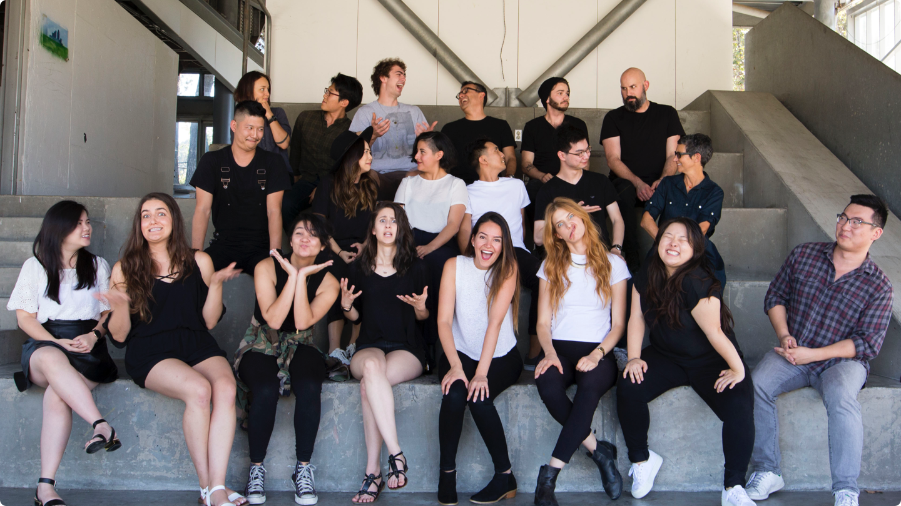
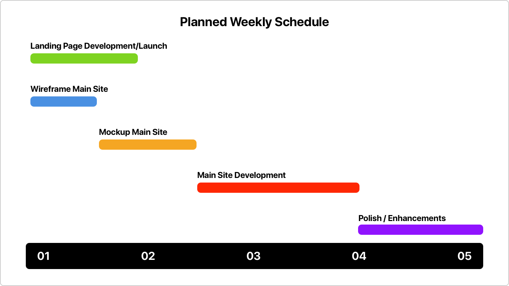

##Overview 
TEDxACCD is a bi-annual event uniquely led by students to create passionate conversations within the community by sharing and spreading ideas intersecting in technology, entertainment, and design. 
 
I joined the student team as the primary designer and engineer for the event website. As part of a 20 person team, I worked with individuals from various backgrounds to deliver the best TEDx experience at ArtCenter. 
 

 
##Goals 
- Create a centralized hub of information for users to access. 
- Promote the event and sell tickets to visitors that are on the fence. 
 
##Challenge 
**We needed a site up and running in 5 weeks.** 
 
With the event due in a few months, we needed to be able to start getting the word out and have an online hub of information.

 
##Role
Being the only Interaction Designer on the team, time and resources were scarce. With the inclusion of Graphic Designers [Yuma Naito](https://www.linkedin.com/in/yuma-naito-76729b76) and [Josephine Law](http://josephinelaw.info/), a sub-team dedicated to just the event page was formed. 

Yuma Naito and Josephine Law would assist me in exploring various visual designs and aesthetics for our final product. Yuma, with his amount of design experience, would help shape and direct the foundational design which we will build upon. My part involved drafting up the wireframes and layouts, creating the final mockups and developing the site for launch. With frequent feedback and idea's bounced between us along the way, everyone had a hand in the final product, while I made sure we stayed on track to deliver the best possible user experience.

##Focus 
**Leadership and Management**   
From previous experience, organization and direction is a must to keep things moving. Referencing various methodologies such as Scrum and Kanban, I created an accelerated timeline of key milestones we needed to hit per week. 
 
**Defending Principles**   
Being in a team of Graphic Designers working on a website caused constant conflicts between the visual and user experience. Compromise was necessary to move forward, but I had to ensure the user wasn't getting the short end of the stick. I would work through every design decision both ways to ultimately show how important that some standards, while not visually unique, are critical to a better experience. 
 
**Growing the Team**   
Working with my 2 Graphic Designers, I trusted their design senses. However, with their limited experience in digital products, I wanted to ensure that they could consider the user in their process. Thus, I took my time to educate and inform them of key principles in creating user-centered designs. Incorporating this into my feedback of any work they present as well. 
 
**Development using Modern Tools**   
After scoping out the scale and requirements of the site with organization leaders, I decided to develop using a static [JAMstack](https://jamstack.org/). Allowing for fast iterations and high performance for the end-user. 
 
##Approach   
With an extremely tight deadline, we had no choice but to accelerate parts of the process. After some discussion with the team and organization leaders, I created a timeline of key milestones we should hit each week. Accessing the situation, I decided to set a soft deadline 1 week earlier than the launch date to help ensure we had at least a minimum viable product to deliver. 
 

 
##Value Proposition   
As a TEDx event, we were excited to bringing in speakers from various fields and were proud to deliver an experience created exclusively by students. It was critical for my team to consider the wider audience that such an event attracts, but also provide a unique experience from our perspective as students of design. 
 
##Research   
No thanks to the accelerated timeline that I created, it was impossible to craft the usual full course research material normally expected. However, basing entirely on assumptions and hypothetical users was too much of a stab in the dark, thus I needed a fast yet reliable source of information. 
 
I reached out to [Elliot Davis](http://elliottrdavis.com/) who had designed/developed the previous TEDxACCD event page, [2015.tedxaccd.com](http://2015.tedxaccd.com/). We discussed the various challenges that he had and what/who we were designing for. Based on site analytics and ticket sales in 2015, we set our primary target audience to be approximately 50% students/alumni, and 50% the local community in Pasadena. Building on his past experiences proved extremely valuable as it allowed me to be more confident in certain decisions which served as the foundation of the product. 
 

 
##Decision 1 
###Single-page vs Multi-page 
While the previous event site and multiple other TEDx events using a single page structure, I didn't think it was suitable for us this time around. 
 
###Pros and Cons 
- **Single-Page**   
  - [+] Tells a better linear story. 
  - [+] Requires less loading between pages. 
  - [-] Too much content can worsen experience. 
  - [-] Less search optimized. 
  - [-] Slower loading with lots of media. 
 
- **Multi-Page**   
  - [+] Scales with large amounts of content. 
  - [+] Better search optimization. 
  - [+] Breaks up information for easier digestion. 
  - [-] Too much content can also worsen experience. 
  - [-] Abrupt transitions between pages. 
 
###Verdict 
After doing some research on user behaviors in the 2015 site and web technologies, on top of briefing the project leaders on what kind of content and usage we're anticipating, I decided on having a multi-page site alongside some newer web technologies to enhance it further. 
 
- **Multi-Page**   
  - We have large amounts of information to display they previously had to reduce a lot of to keep things concise, however for such an event, the user should have all the information they need to make the best decision. 
  - Many users will want to have the schedule accessible on their phone when they're at the event, this allows them to bookmark the page and have it always ready. 
  - We will put some more emphasis on the homepage to deliver a quick linear story to the user while branching out information. 
  - Utilizing PJAX (PushState + AJAX) we can create seamless transitions between pages, removing sudden breaks in the experience, and have the site feeling more responsive. 
 

##Wireframe 
Learning from my past experiences, I approached wireframes differently this time around. Instead of creating high fidelity digital wireframes, I stuck with the good old pen and paper. This can be attributed to 2 reasons: 
 
- **Refining over Remaking**   
  With the deadline of just a week, it was difficult to justify the additional time in what amounts to re-creating the paper versions when it can be better spent refining the layout and experience. 
   
- **Over designing UX**   
  Wireframes that ultimately resemble a final product leaves little room for the visual design to grow. Perhaps I don't get it yet, but this [article on Medium](https://medium.muz.li/wireframes-are-dead-why-i-havent-used-wires-in-over-a-year-8027fcce1b3f) resonated my past frustrations. 
   

###Mobile First
The layout was sketched with mobile first in mind including details on all necessary site content/copy. Everything would be checked off by the organizers and marketing team to ensure we're on the same page.

With my previous experience working on responsive layouts, I was able to anticipate how the layouts will respond to screen widths as I sketch. Due to increasing pressure on time and resources available, I elected to omit elaborate changes to the layout on Desktop sizes and moved swiftly to mock up the visual design.

##Visual Design 
In order to follow a unified language, the Graphics team has created a brand style guide for us to use as reference. An important part of our brand was to tailor the design to each medium, and thus me and my team took some liberties to craft a unique experience that was still inline with the values and key aspects of the identity. 

Yuma Naito assisted in creating a unique visual language based on bold typography and colors, along with Josephine Law who excelled in pushing the envelope of common design practices. I would later utilize their work as a foundation to the design along with their feedback and ideas to create the final design mockups for development.

###Adaptability 
While the design may seem overly dependent on text, this was a decision made in order to allow for maximum adaptability in the future. With the Graphics team heavily focused on production of other assets for the event, imagery and graphical resources for the website is lacking. By replying mostly on text, we allow room for the design to grow and incorporate images in certain areas, as well as account for any sudden need for additional sections or features. 

###Modularity 
In addition to keeping the design light weight and adaptable, the design is made up of smaller components that make up the greater whole. From text links to templates of how user profiles come together, the design utilizes reusable components to further enhance our adaptability in addition to keeping the development time low by reducing the need for creating dedicated layouts throughout the website. 

###Micro-Interactions
To further enhance the user's experience, I took care to implement various little interactions for users when they scroll, hover or click through the site. To ensure that these bits of animation don't hinder any aspects of the interactions, I made sure that they lasted only for about 200 – 500ms and rigorously tested their repeatability to not feel distracting or slow.

<video width="100%" height="100%" loop="" autoplay="" playsinline="" class="fullView">
  <source src="/videos/tedx-micro.mp4" type="video/mp4">
</video>

##Development 
Thanks to preparation I had done beforehand, I was able to develop and launch the site in the 3 weeks left. While I won't dive too deep on this process for now, however I did my best to keep with common industry best practices and standards when developing the product, to be as close to experiencing a "real" developer's workflow when possible. 

The entire source code for the website can be found on my Github:   
https://github.com/jamescchu/tedxaccd-2017 

##User Testing 
With the preliminary designs and development work finished, we reached out to 19 users and had them go through the website with minimal instructions with the objective of finding all the information they may want to know and any other feedback/opinions. 

To help you contextualize these findings, check out [version 0.0.10](https://develop-0-0-10--tedxaccd-2017.netlify.com/) of the site which we used for this test.

###Key Insights 
- [+] Navigation is simple and understandable 
- [+] Liked the dropping "L" micro-interaction 
- [-] Arrangement of "Beauty of the Fall" is unclear 
- [-] "Red Dot" to buy tickets on the right side feels out of place 
- [-] Font sizes feel large when viewing 
- [-] Floating "Beauty of the Fall" is distracting when on mobile

###Assessments 
The feedback helped tremendously as it was a relief to know there weren't major usability issues, I was rather shocked that there were a lot of comments towards the typography on the page. After taking account of the multiple responses, I assessed them carefully. 

- As I work on a large display, I failed to notice that people viewing on smaller 13" and 15" MacBooks did not scale the text properly, leading to extremely oversized typography. 
- Redesigning the "Red Dot" interaction, I expanded it further with a clear ticket icon alongside scrolling indicators as I noticed some people were confused if they could scroll on the first page. 
- To better reiterate our theme, I decided to use it directly as the main headline on our index page. 
- The distracting floating text was something that needed more attention and is expanded in the next section. 

A complete list of changes I have made can be found in [my changelog](https://github.com/jamescchu/tedxaccd-2017/blob/master/CHANGELOG.md#010---2017-08-12).
 
##Decision 2 
###To Float or Not to Float 
Mentioned by a lot of our users, the floating "Beauty of the Fall" was actually distracting from the experience when on mobile. They described the overlaping text as an "error" and generally unappealing. Hence the following were the options I had considered. 
 
- **Add a background** 
  - [+] Makes text overlap feel less like an issue. 
  - [-] Floating boxes emphasize the problem more. 
- **Removed the text entirely** 
  - [+] Get rid of the problem entirely. 
  - [-] As an integral part of the brand, we lose our identity. 
- **Hide the floating text while scrolling** 
  - [+] A more dynamic solution removes the text when you scroll. 
  - [-] Implementation is difficult. 
  - [-] Falling "L" will appear out of nowhere. 
- **Hide the navigation bar while scrolling** 
  - [+] Moves the floating text further up the screen so it's not a focus point. 
  - [+] Keeps the entire text interaction and identity intact. 
  - [-] Hides navigation bar when scrolling down. 
 
###Verdict 
- **Hide the navigation bar while scrolling** 
  - While not a direct solution, by moving the text up as the navigation bar hides, it removes it from being close to the center of the screen, and thus out of immediate focus for the user. 
  - This allows us to keep the entire design and interaction intact, while reducing the amount of complaints we have. 
  - Although the navigation bar is not fixed, a "back to top" arrow on the right side of the screen should make navigating easily accessible. Due to technical limitations, I was unable to have the navigation slide back down from the top as you scroll up.
 
<video width="100%" height="100%" loop="" autoplay="" playsinline="" class="fullView">
  <source src="/videos/tedx-compare.mp4" type="video/mp4">
</video>

##Maintenance
With the design and launch completed, we switch to the second phase of the product. Due to the intial rush to deliver, I had intentionally excluded a few non-critical pages for launch. These were the Schedule and Media pages, which happen close-to/during the event and post event. Thanks to the modularity of the design from the beginning, we're confident to be able to incorporate the same experience consistently throughout any additional requirements.
 
##Outcome 
With the design, development and launch completed, this about wraps up the project for the time being. While the tight deadline really restricted the amount of work we could do, I'm extremely happy to be able to achieve such a result from sketches on paper to a full blown site in a mere 5 weeks, and I hope you do too.

[Check out the live site!](https://2017.tedxaccd.com)

###Key Learnings
As with any experience, learning is a big part in helping me grow as a designer, and this is no different.

- **Can't Win Everything**  
Working with lots of other talented individuals was more challenging than I thought. Everyone has their own set of experiences and principles that they've developed, and more often than not, it's different than my own. Learning to trust each other's judgements and compromising when necessary becomes important in working with others to reach new heights.

- **Step Back to See the Big Picture**  
While neck deep in developing the site during the final weeks, I was in a bit of a mental burn out, growing more and more complacent to changes and feedback. I really have to thank my bud [Justin Kwak](http://justinkwak.com/) for giving me a stern wake up call and helping me realize that my complacency had totally side-tracked the user experience for the worse. Sometimes stepping away for a bit and having a 2nd opinion can really help you see things you don't realize when you're too close.

- **Step Up to do the Right Thing**  
For some time, I was the sole person that was just there to make the website, following the orders of others as I went along. However, the mockups I was given were totally unusable from both a technical and user perspective. At that point I knew that simply sitting around and waiting for someone would achieve nothing, so I decided to step up. Having conversations about my plans and ambitions, I would be put in charge of a small "web team", and that's how everything came to be.
